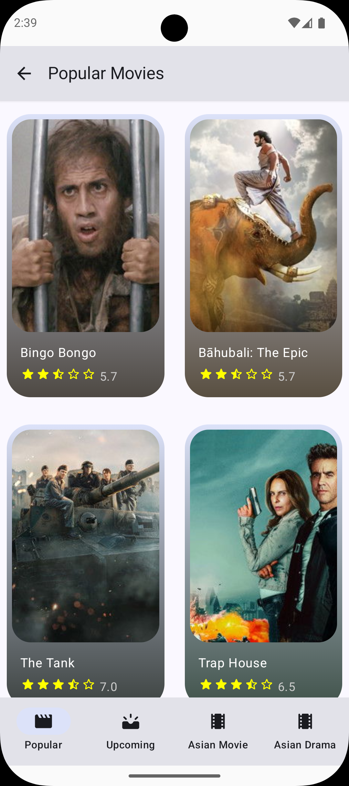
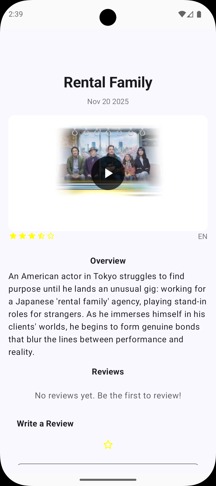
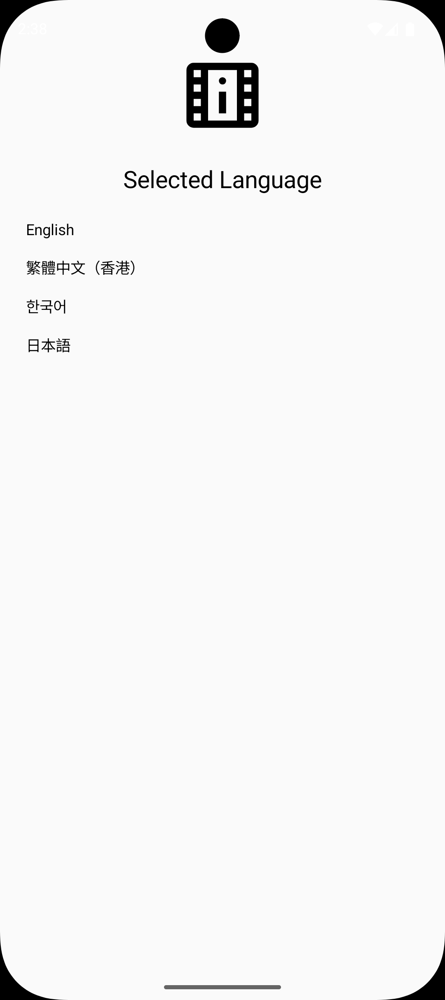

📰 News App (Android)

OverView
The Movies App fetches movie data from TMDB and presents it in a clean, responsive UI.Users can
explore popular and categorized movies,view detailed information,translate the movie overview into a
selected language,and save favorite movies locally for office access.

The app follows MVVM architecture with a clear separation of concerns and uses modern Android
libraries and tools.

✨ Features

🎞 Browse Movies

- Popular movies fetched from TMDB
- Category-based browsing (e.g.Asian Movies, Asian Drama)

  
📄 Movie Details Screen
- Poster, title, rating, release date, and overview
- Reviews and ratings
- Clean, scrollable layout optimized for reading

🌍 Plot Translation
- Translate movie overview into a selected language
- Language selection screen for user preference

⭐ Favorites
- Save favorite movies locally
- Persisted using Room database

  
💾 Offline Support
- Cached movie data, ratings, and reviews
- Graceful “No Internet” error handling

🔄 State Handling
- Loading, success, empty, and error UI states
- User-friendly messaging when data is unavailable

🛠 Tech Stack
- Language: Kotlin
- UI: Jetpack Compose
- Architecture: MVVM (Model-View-ViewModel)
- Networking: Retrofit (TMDB API)
- Local Storage: Room Database
- Async: Kotlin Coroutines & Flow
- Data Pattern: Repository Pattern

🧩 Architecture
The app follows MVVM architecture to ensure scalability and maintainability:

- UI Layer(Compose)
- Stateless composables
- Observes UI state from ViewModels

- ViewModel Layeer
- Manages UI state and business logic
- Exposes data using StateFlow/Flow

- Repository Layer
- Single source of truth
- Coordinates remote API and local database

- Data Layer
- Remote: TMDB API
- Local: Room entities & DAO

📱 Screenshots

   
 
 Popular Movies · Movie Details 
 
   
 
 Language Selection · Offline / No Internet State 

🚀 How to Run
1. Clone the repository:

git clone https://github.com/your-username/MoviesApp.git

2. Open the project in Android Studio

3. Add your TMDB API key locally (see below)

4. Sync Gradle dependencies

5. Run on an emulator or physical Android device

🔐 API Key Configuration

This project uses the TMDB API.

⚠️ API keys are not committed to this repository.

Recommended setup:

- Add the key to local.properties

- Inject it via BuildConfig

TMDB_API_KEY=your_api_key_here

📈 What This Project Demonstrates

- Modern Android UI with Jetpack Compose
- Real-world MVVM architecture
- Offline-first thinking
- Local persistence with Room
- State-driven UI and error handling
- Clean, readable,and maintainable code

🧑‍💻 Author

Billy Yan

Aspiring Android Developer focused on Kotlin, Jetpack Compose, and modern Android app architecture

 
✅ Recruiter Note

This project is intended to showcase practical Android development skills through personal and self-
directed work.
